# 个人财务管理系统 — 设计文档

> 优先级标记：**P0** = 作业底线（缺了不行）　**P1** = 加分项（增强差异性和完成度）　**P2** = 答辩亮点（讨论/展望用，不强制实现）

---

## 一、设计修正说明

相比最初方案，做了以下调整：

1. **删除观察者模式**：去掉 `BudgetObserver`、`NotificationService`、`Budget` 中的观察者管理。预警改为 Controller 内直接条件判断 + 消息记录，不增加额外类
2. **删除无意义中间层**：去掉 `DiagnosticContext`（纯转发）、`CategoryCutRatioProvider`（Map 套壳）
3. **Budget 回归本职**：只保留 `category`、`monthlyLimit`、`currentSpent`、`isExceeded()`、`addExpense()`，不再混杂观察者管理
4. **新增多账户维度**：`Transaction` 增加 `account` 字段，`AccountType` 枚举（WECHAT/ALIPAY/CASH/BANK_CARD）
5. **建议升级为值对象**：`Suggestion` 替代裸 `String`，含 `priority`、`impactAmount`、`category`、`description`，数字来自实际数据计算
6. **恩格尔系数改造**：改为 `ConsumptionStructureStrategy`（消费结构分析），区分基础饮食与社交饮食，适配大学生群体
7. **三策略族架构**：诊断策略(P0) + 预算规则(P1) + 储蓄方法(P1)，统一 Strategy 模式骨架

---

## 二、类结构

### P0 — 作业底线（13 个类型）

#### 2.1 核心实体

| 类 | 属性 | 方法 | 优先级 |
|---|---|---|---|
| `Transaction` | `amount: float`, `type: str`(收入/支出), `category: str`, `account: AccountType`, `date: date`, `note: str` | `is_expense() -> bool`, `is_income() -> bool`, getters | P0 |
| `Budget` | `category: str`, `monthly_limit: float`, `current_spent: float` | `is_exceeded() -> bool`, `get_remaining() -> float`, `add_expense(amount: float)` | P0 |
| `AccountType` | 枚举：`WECHAT`, `ALIPAY`, `CASH`, `BANK_CARD` | — | P0 |

#### 2.2 诊断模块（策略模式 — 核心设计模式体现）

```
DiagnosticStrategy (接口)
    │
    ├── SavingRateStrategy          储蓄率诊断
    ├── CategoryOverrunStrategy      类别超支诊断
    └── ConsumptionStructureStrategy  消费结构分析（恩格尔系数改造版）
    
诊断输出：
    DiagnosisReport
    ├── overall_level: HealthLevel (HEALTHY / WARNING / CRITICAL)
    ├── dimension_details: List[DimensionDetail]
    │     └── DimensionDetail (strategy_name, score, level, suggestion)
    └── suggestions: List[Suggestion]  (按 impact_amount 降序)
```

| 类/接口 | 职责 | 优先级 |
|---|---|---|
| `DiagnosticStrategy`（接口） | `diagnose(transactions: List[Transaction], budgets: List[Budget]) -> DiagnosisReport` | P0 |
| `SavingRateStrategy` | 计算储蓄率 = (总收入-总支出)/总收入，低于阈值则告警 | P0 |
| `CategoryOverrunStrategy` | 遍历所有 Budget，检查各类别是否超支，输出超支明细 | P0 |
| `ConsumptionStructureStrategy` | 分析基础饮食/社交饮食/娱乐/学习占比，与健康区间比较（学生适配版恩格尔系数） | P0 |
| `DiagnosisReport` | 聚合：`overall_level` + `dimension_details: List[DimensionDetail]` + `suggestions: List[Suggestion]` | P0 |
| `HealthLevel`（枚举） | `HEALTHY`（储蓄率≥20%且无严重超支）、`WARNING`（任一维度亮黄灯）、`CRITICAL`（储蓄率<0 或多维度严重超支） | P0 |
| `Suggestion`（值对象） | `priority: int`, `impact_amount: float`, `category: str`, `description: str` | P0 |

> **Suggestion 生成原理**（非模板句）：
> ```
> social_food = 外卖 + 聚餐
> social_ratio = social_food / total_expense
> if social_ratio > 0.15:
>     excess = social_food - total_expense * 0.15
>     weekly_save = excess / 4.3  # 约每周可省
>     Suggestion(
>         priority=1,
>         impact_amount=excess,
>         category="社交饮食",
>         description=f"外卖+聚餐月均¥{social_food:.0f}，占比{social_ratio:.0%}(建议<15%)。"
>                     f"若每周减少1次聚餐(约¥{avg_cost:.0f})，月省¥{avg_cost*4:.0f}，年省¥{avg_cost*4*12:.0f}"
>     )
> ```
> 所有数字（金额、比例、估算节省）均从实际数据计算得出。

#### 2.3 储蓄倒推

| 类 | 职责 | 优先级 |
|---|---|---|
| `SavingGoalCalculator` | 内部持有 `cut_ratios: Dict[str, float]`（各类别削减比例，默认餐饮40%、娱乐60%）。方法：`calculate_plan(target: float, months: int, history: List[Transaction]) -> MonthlyPlan`<br>逻辑：(1)从历史算月均收入/支出→自然结余 (2)若目标/月≤自然结余则无需调整 (3)否则计算差额，从弹性类别按比例削减 | P0 |
| `MonthlyPlan` | 字段：`required_monthly_saving`, `current_natural_saving`, `extra_cut_needed`, `category_cuts: Dict[str, float]`, `suggestions: List[Suggestion]` | P0 |

#### 2.4 主控

| 类 | 职责 | 优先级 |
|---|---|---|
| `FinanceController` | 持有 `transactions`, `budgets`, `diagnosis_strategy: DiagnosticStrategy`, `saving_calculator: SavingGoalCalculator`, `alert_messages: List[str]`<br>方法：`add_transaction(t)`, `import_csv(path)`, `set_budget(b)`, `generate_diagnosis()`, `generate_saving_plan(target, months)`, `get_alerts()` | P0 |

#### 2.5 预警（无额外类）

在 `FinanceController.add_transaction()` 中：
1. 保存 transaction
2. 若为支出，找到对应 category 的 Budget，调用 `budget.add_expense(amount)`
3. 若 `budget.is_exceeded()`，生成告警消息添加到 `alert_messages`

---

### P1 — 加分项（增强完成度）

#### 2.6 复合诊断

| 类/接口 | 职责 | 优先级 |
|---|---|---|
| `CompositeDiagnosis` | 实现 `DiagnosticStrategy`，内部持有 `List[(DiagnosticStrategy, float)]`（子策略+权重）。一次 `diagnose()` 并行运行全部子策略，加权算综合分。综合分=Σ(子得分×权重)，映射 HealthLevel | P1 |

#### 2.7 预算规则族（第二个策略族）

```
BudgetRule (接口)
    │
    ├── FixedBudgetRule    手动固定阈值
    └── Rule503020         50%必要/30%想要/20%储蓄
```

| 类/接口 | 职责 | 优先级 |
|---|---|---|
| `BudgetRule`（接口） | `allocate(income: float, history: List[Transaction]) -> Dict[str, float]` — 返回各类别建议预算 | P1 |
| `FixedBudgetRule` | 用户手动设定各类别固定阈值（等于当前模式的提取） | P1 |
| `Rule503020` | `necessities = income*0.5, wants = income*0.3, savings = income*0.2`。`necessities` 再细分为餐饮、交通、日用品等子类（按历史比例分配） | P1 |

#### 2.8 储蓄方法族（第三个策略族）

```
SavingsMethod (接口)
    │
    ├── FixedAmountMethod   每月固定金额
    ├── Week52Method        52周存款挑战
    └── PercentageMethod    收入固定比例
```

| 类/接口 | 职责 | 优先级 |
|---|---|---|
| `SavingsMethod`（接口） | `calculate(monthly_income: float, history: List[Transaction]) -> SavingsPlan` | P1 |
| `FixedAmountMethod` | 每月固定 ¥N | P1 |
| `Week52Method` | 标准版：第 n 周存 n×¥10，年累计 ¥13,780。<br>反向版：第 n 周存 (53-n)×¥10，年初多存、年末轻松。<br>返回 `SavingsPlan` 含 52 周明细 | P1 |
| `PercentageMethod` | 每月收入 × N%（如 20%），随收入浮动 | P1 |
| `SavingsPlan`（值对象） | `weekly_amounts: List[float]` (52项), `annual_total: float`, `description: str` | P1 |

> P1 核心价值：三个策略族（诊断 + 预算 + 储蓄）统一使用 Strategy 模式骨架，形成"规则驱动"的统一设计语言。答辩时最有说服力的架构亮点。

---

### P2 — 答辩展望

| 内容 | 说明 |
|---|---|
| `EnvelopeRule` | 弹性类别硬封顶，不可跨类挪用，月余滚存 |
| `PayYourselfFirstRule` | 先储蓄（自动扣除）→ 付账单 → 剩余随意花 |
| `ProportionalRule` | 元模型 — 用户自定义比例（如 40/30/20/10） |
| `RoundUpMethod` | 每笔消费向上取整（¥12.5→¥13），差额自动计入储蓄 |
| 多触发时机 | 录入时触发轻量诊断 / 手动触发全量诊断 / 月末自动趋势对比 |
| 混合预算规则 | 固定支出→FixedBudgetRule，弹性支出→EnvelopeRule，储蓄→PayYourselfFirstRule |
| JSON 持久化 | 退出时保存、启动时加载 |
| 策略元信息注册 | 维护策略的触发条件/数据需求/输出类型，Controller 按上下文自动选择策略子集 |

---

## 三、关键设计决策

### 3.1 恩格尔系数 → 消费结构分析（学生适配）

传统恩格尔系数（食品支出/总支出）不能直接套用于大学生：

| 偏差 | 说明 | 改造方式 |
|---|---|---|
| 消费结构差异 | 无房租/房贷，食堂廉价，食品占比自然偏高，无法与传统阈值对标 | 区分**基础饮食**（食堂+超市食材）和**社交饮食**（外卖+聚餐），二者含义完全不同 |
| 收入定义模糊 | 生活费来自父母，非劳动所得。"储蓄"可能是本月没花完的被动结余 | 改用"结余率"，区分被动结余与主动储蓄 |
| 参考基准失效 | 传统阈值（>59%=贫困等）建立于家庭收支调查 | 健康区间改为相对标准：与自身前三月均值对比、各类别合理占比区间 |

**改造后**：`ConsumptionStructureStrategy` 分析四个维度 — 基础饮食比、社交饮食比、娱乐比、学习/自我投资比，每维度独立评分后综合。

### 3.2 52 周存款法与储蓄方法族

| 方法 | 逻辑 | 年总额 | 适用场景 |
|---|---|---|---|
| `Week52Method`（标准） | 第 n 周存 n×¥10 | ¥13,780 | 逐周递增，培养储蓄习惯 |
| `Week52Method`（反向） | 第 n 周存 (53-n)×¥10 | ¥13,780 | 年初有压岁钱，前期多存后期轻松 |
| `FixedAmountMethod` | 每月固定 ¥N | ¥N×12 | 最简单直接 |
| `PercentageMethod` | 收入 × N% | 随收入浮动 | 最稳健，自动适应 |

`SavingsMethod` 回答"怎么存"，`SavingGoalCalculator` 回答"存多少"——二者互补。

### 3.3 策略交互方式

| 交互方式 | 应用位置 | 采用 |
|---|---|---|
| 加权聚合 | `CompositeDiagnosis` 聚合 3 个诊断子策略，各有权重 | P1 |
| 管道/顺序 | 诊断内部自然流程：数据筛选→指标计算→等级判定 | 不显式建模 |
| 条件委派 | Controller 根据用户是否有稳定收入选择 `BudgetRule` | P1 |
| 竞争 | — | 不采用 |

---

## 四、不在类图中的基础设施

类图只展示领域模型和设计模式的结构关系。以下属于基础设施/表现层，单独说明：

| 模块 | 负责 | 优先级 | 说明 |
|---|---|---|---|
| CSV 导入器（`csv_importer.py`） | B | P0 | 解析约五个月 CSV 文件（列：日期, 金额, 类型, 类别, 账户, 备注），跳过空行和格式错误行并记录 |
| 类别标准化（`CategoryNormalizer`） | B | P0 | 映射表：`{"三餐":"餐饮", "食堂":"餐饮", "吃饭":"餐饮", "淘宝":"购物", ...}` → 统一类别名 |
| PySide6 GUI（`gui/`） | A | P0 | `MainWindow`, `TransactionPage`, `DiagnosisPage`, `BudgetPage`, `SavingPlanPage`，信号/槽绑定 |
| 图表绘制（`gui/charts.py`） | A | P1 | matplotlib 嵌入 PySide6：月度趋势折线图、类别占比饼图 |
| 演示数据准备 | B | P1 | 从 CSV 中选取健康月和不健康月做对比演示 |
| JSON 持久化（`persistence.py`） | C | P2 | `save(controller, path)` / `load(path) -> FinanceController` |

---

## 五、类图（Mermaid，提交用）

```mermaid
classDiagram
    direction TB

    %% ==================== 核心实体 ====================

    class Transaction {
        -float amount
        -String type
        -String category
        -AccountType account
        -LocalDate date
        -String note
        +isExpense() bool
        +isIncome() bool
    }

    class Budget {
        -String category
        -float monthlyLimit
        -float currentSpent
        +isExceeded() bool
        +getRemaining() float
        +addExpense(float amount) void
    }

    class AccountType {
        <<enumeration>>
        WECHAT
        ALIPAY
        CASH
        BANK_CARD
    }

    Transaction --> AccountType : uses

    %% ==================== 诊断策略族 ====================

    class DiagnosticStrategy {
        <<interface>>
        +diagnose(transactions, budgets) DiagnosisReport
    }

    class SavingRateStrategy {
        +diagnose(transactions, budgets) DiagnosisReport
    }

    class CategoryOverrunStrategy {
        +diagnose(transactions, budgets) DiagnosisReport
    }

    class ConsumptionStructureStrategy {
        +diagnose(transactions, budgets) DiagnosisReport
    }

    class CompositeDiagnosis {
        -List~StrategyWeight~ strategies
        +diagnose(transactions, budgets) DiagnosisReport
    }

    class DiagnosisReport {
        -HealthLevel overallLevel
        -float overallScore
        -List~DimensionDetail~ dimensions
        -List~Suggestion~ suggestions
        +getOverallLevel() HealthLevel
        +getSuggestions() List~Suggestion~
    }

    class Suggestion {
        -int priority
        -float impactAmount
        -String category
        -String description
    }

    class HealthLevel {
        <<enumeration>>
        HEALTHY
        WARNING
        CRITICAL
    }

    class DimensionDetail {
        -String strategyName
        -float score
        -HealthLevel level
        -Suggestion suggestion
    }

    DiagnosticStrategy <|.. SavingRateStrategy : implements
    DiagnosticStrategy <|.. CategoryOverrunStrategy : implements
    DiagnosticStrategy <|.. ConsumptionStructureStrategy : implements
    DiagnosticStrategy <|.. CompositeDiagnosis : implements
    CompositeDiagnosis o--> DiagnosticStrategy : holds
    DiagnosticStrategy ..> DiagnosisReport : returns
    DiagnosisReport --> HealthLevel : uses
    DiagnosisReport --> Suggestion : contains
    DiagnosisReport --> DimensionDetail : contains
    DimensionDetail --> HealthLevel : uses
    DimensionDetail --> Suggestion : contains

    %% ==================== 预算规则族（P1）====================

    class BudgetRule {
        <<interface>>
        +allocate(income, history) Map~String, Float~
    }

    class FixedBudgetRule {
        +allocate(income, history) Map~String, Float~
    }

    class Rule503020 {
        +allocate(income, history) Map~String, Float~
    }

    BudgetRule <|.. FixedBudgetRule : implements
    BudgetRule <|.. Rule503020 : implements

    %% ==================== 储蓄方法族（P1）====================

    class SavingsMethod {
        <<interface>>
        +calculate(monthlyIncome, history) SavingsPlan
    }

    class FixedAmountMethod {
        +calculate(monthlyIncome, history) SavingsPlan
    }

    class Week52Method {
        +calculate(monthlyIncome, history) SavingsPlan
    }

    class PercentageMethod {
        +calculate(monthlyIncome, history) SavingsPlan
    }

    class SavingsPlan {
        -List~Float~ weeklyAmounts
        -float annualTotal
        -String description
    }

    SavingsMethod <|.. FixedAmountMethod : implements
    SavingsMethod <|.. Week52Method : implements
    SavingsMethod <|.. PercentageMethod : implements
    SavingsMethod ..> SavingsPlan : returns

    %% ==================== 储蓄倒推 ====================

    class SavingGoalCalculator {
        -Map~String, Float~ cutRatios
        +calculatePlan(target, months, history) MonthlyPlan
    }

    class MonthlyPlan {
        -float requiredMonthlySaving
        -float currentNaturalSaving
        -float extraCutNeeded
        -Map~String, Float~ categoryCuts
        -List~Suggestion~ suggestions
    }

    SavingGoalCalculator ..> MonthlyPlan : returns
    MonthlyPlan --> Suggestion : contains

    %% ==================== 主控 ====================

    class FinanceController {
        -List~Transaction~ transactions
        -List~Budget~ budgets
        -DiagnosticStrategy diagnosisStrategy
        -BudgetRule budgetRule
        -SavingsMethod savingsMethod
        -SavingGoalCalculator savingCalculator
        -List~String~ alertMessages
        +addTransaction(Transaction t) void
        +importCsv(String path) void
        +generateDiagnosis() DiagnosisReport
        +generateSavingPlan(target, months) MonthlyPlan
        +applyBudgetRule(income) Map~String, Float~
        +getAlertMessages() List~String~
    }

    FinanceController --> Transaction : manages
    FinanceController --> Budget : manages
    FinanceController --> DiagnosticStrategy : uses
    FinanceController --> BudgetRule : uses
    FinanceController --> SavingsMethod : uses
    FinanceController --> SavingGoalCalculator : uses
```



**三策略族总结**：

| 策略族 | 接口 | 具体实现 | 优先级 |
|---|---|---|---|
| 诊断 | `DiagnosticStrategy` | `SavingRateStrategy`, `CategoryOverrunStrategy`, `ConsumptionStructureStrategy`, `CompositeDiagnosis` | P0（前3个）+ P1（Composite） |
| 预算 | `BudgetRule` | `FixedBudgetRule`, `Rule503020` | P1 |
| 储蓄 | `SavingsMethod` | `FixedAmountMethod`, `Week52Method`, `PercentageMethod` | P1 |

P0 共 13 个类型，P0+P1 共约 18 个类型。

---

## 六、五人分工

| 编号 | 角色 | P0 任务 | P1 任务 |
|---|---|---|---|
| **A** | GUI | PySide6 全部界面（主窗口、交易录入、诊断报告、预算设置、储蓄计划、告警） | 图表绘制（matplotlib 嵌入：趋势折线图、占比饼图） |
| **B** | 集成+CSV | CSV 导入模块、类别标准化、FinanceController 骨架 | 集成测试、演示数据准备 |
| **C** | 核心实体 | `Transaction`, `Budget`, `AccountType`, `Suggestion`, `DimensionDetail`, 预警逻辑 | — |
| **D** | 诊断模块 | `DiagnosticStrategy` 接口 + 3 个策略 + `DiagnosisReport` + `HealthLevel` | `CompositeDiagnosis`（加权聚合） |
| **E** | 预算+储蓄 | `SavingGoalCalculator`, `MonthlyPlan` | `BudgetRule` 族 + `SavingsMethod` 族 + `SavingsPlan` |

### 时间线

| 阶段 | A（GUI） | B（集成） | C（实体） | D（诊断） | E（预算储蓄） |
|---|---|---|---|---|---|
| 第 1 周 | 设计界面布局、学 PySide6、硬编码假数据做界面 | 最小 CLI 原型（验证 API） | Transaction、Budget、AccountType | DiagnosticStrategy 接口定义 | SavingGoalCalculator |
| 第 2 周 | 连接后端、实现各页面 | CSV 导入模块 + 类别标准化 | FinanceController + 预警 | 3 个策略实现 | BudgetRule 族 + SavingsMethod 族 |
| 第 3 周 | 图表绑定、美化 | 集成测试、联调 bug | 配合联调 | CompositeDiagnosis | MonthlyPlan + 配合联调 |
| 第 4 周 | 最终打磨 | 演示数据 + 文档 | 配合联调 | 配合联调 | 配合联调 |

> A 第 1 周用假数据独立开发界面，不等后端。第 2 周后端陆续完成后对接。GUI 和后端并行，不互相阻塞。

---

## 七、实现顺序

### 第一阶段：P0 底线（第 1-2 周）

1. **接口先行**（D+E 协商，C 参与）：定义 `DiagnosticStrategy`、`DiagnosisReport`、`HealthLevel`、`Suggestion`、`DimensionDetail`、`MonthlyPlan` 的数据结构
2. **核心实体**（C）：`Transaction`（含 account 字段）、`AccountType`、`Budget`（精简版，无观察者）
3. **诊断策略实现**（D）：`SavingRateStrategy`、`CategoryOverrunStrategy`、`ConsumptionStructureStrategy`
4. **储蓄倒推**（E）：`SavingGoalCalculator`（内含 cutRatios Map）+ `MonthlyPlan`
5. **Controller + 预警**（C）：`FinanceController`（addTransaction、generateDiagnosis、generateSavingPlan、importCsv、预警逻辑）
6. **CSV 导入**（B）：解析模块 + `CategoryNormalizer` 类别标准化映射
7. **GUI 核心页面**（A）：交易录入页、诊断报告展示页、预算设置页、储蓄计划页

### 第二阶段：P1 加分（第 2-3 周）

8. **CompositeDiagnosis**（D）：加权聚合，维度明细分
9. **BudgetRule 族**（E）：接口 + `FixedBudgetRule` + `Rule503020`
10. **SavingsMethod 族**（E）：接口 + `FixedAmountMethod` + `Week52Method` + `PercentageMethod` + `SavingsPlan`
11. **GUI 图表**（A）：月度趋势折线图、类别占比饼图（matplotlib + PySide6）
12. **集成测试**（B）：用 CSV 真实数据跑完整流程，验证各策略输出

### 第三阶段：P2 答辩亮点（第 4 周，按剩余时间选择性实现）

13. `EnvelopeRule`、`PayYourselfFirstRule`（E）
14. `RoundUpMethod`（E）
15. 多触发时机、混合预算规则（C+E 联调）
16. JSON 持久化（C）
17. 答辩文档/PPT 中讨论策略元信息注册、动态阈值等架构扩展点（可不实现代码）

---

## 八、验证清单

### P0 通过标准
- [ ] CSV 文件成功导入，交易列表正确显示
- [ ] 三个诊断策略各自输出合理结果（Suggestion 中数字来自实际数据计算）
- [ ] `DiagnosisReport` 中 suggestions 按 `impactAmount` 降序排列
- [ ] 储蓄倒推对不同目标金额输出不同 `MonthlyPlan`（目标越大削减越多）
- [ ] 添加支出超预算时，`alertMessages` 记录告警
- [ ] GUI 四个核心页面（交易录入、诊断报告、预算设置、储蓄计划）功能完整
- [ ] P0 共 13 个类型，无 `BudgetObserver`/`NotificationService`/`DiagnosticContext`/`CategoryCutRatioProvider` 残留

### P1 通过标准
- [ ] `CompositeDiagnosis` 一次运行输出综合评分 + 各维度明细
- [ ] 切换 `BudgetRule`（Fixed vs 503020），预算分配不同
- [ ] 切换 `SavingsMethod`（FixedAmount vs Week52 vs Percentage），储蓄计划不同
- [ ] GUI 图表：月度消费趋势折线图 + 类别占比饼图正常渲染

### P2（如有）
- [ ] 至少 1 个额外 `BudgetRule` 或 `SavingsMethod` 实现
- [ ] 文档/答辩 PPT 中包含架构扩展点讨论
