# 个人财务管理系统 — UML 类图

```mermaid
classDiagram
    direction TB

    %% ==================== 核心实体 ====================

    class Transaction {
        -float amount
        -String type
        -AccountType account
        -String category
        -LocalDate date
        -String note
        +isExpense() bool
        +isIncome() bool
        +getAmount() float
        +getCategory() String
        +getAccount() AccountType
        +getDate() LocalDate
    }

    class Budget {
        -String category
        -float monthlyLimit
        -float currentSpent
        +isExceeded() bool
        +getRemaining() float
        +addExpense(float amount) void
    }

    class AccountType {
        <<enumeration>>
        WECHAT
        ALIPAY
        CASH
        BANK_CARD
    }

    Transaction --> AccountType : uses

    %% ==================== 诊断策略族（核心设计模式）====================

    class DiagnosticStrategy {
        <<interface>>
        +diagnose(List~Transaction~ transactions, List~Budget~ budgets) DiagnosisReport
    }

    class SavingRateStrategy {
        +diagnose(List~Transaction~ transactions, List~Budget~ budgets) DiagnosisReport
    }

    class CategoryOverrunStrategy {
        +diagnose(List~Transaction~ transactions, List~Budget~ budgets) DiagnosisReport
    }

    class ConsumptionStructureStrategy {
        +diagnose(List~Transaction~ transactions, List~Budget~ budgets) DiagnosisReport
    }

    class CompositeDiagnosis {
        -List~StrategyWeight~ strategies
        +diagnose(List~Transaction~ transactions, List~Budget~ budgets) DiagnosisReport
        +addStrategy(DiagnosticStrategy s, float weight) void
    }

    DiagnosticStrategy <|.. SavingRateStrategy : implements
    DiagnosticStrategy <|.. CategoryOverrunStrategy : implements
    DiagnosticStrategy <|.. ConsumptionStructureStrategy : implements
    DiagnosticStrategy <|.. CompositeDiagnosis : implements
    CompositeDiagnosis o--> DiagnosticStrategy : holds 1..*

    %% ==================== 诊断结果 ====================

    class DiagnosisReport {
        -HealthLevel overallLevel
        -float overallScore
        -List~DimensionDetail~ dimensions
        -List~Suggestion~ suggestions
        +getOverallLevel() HealthLevel
        +getOverallScore() float
        +getDimensions() List~DimensionDetail~
        +getSuggestions() List~Suggestion~
    }

    class DimensionDetail {
        -String strategyName
        -float score
        -HealthLevel level
        -Suggestion suggestion
        +getStrategyName() String
        +getScore() float
        +getLevel() HealthLevel
        +getSuggestion() Suggestion
    }

    class Suggestion {
        -int priority
        -float impactAmount
        -String category
        -String description
        +getPriority() int
        +getImpactAmount() float
        +getCategory() String
        +getDescription() String
    }

    class HealthLevel {
        <<enumeration>>
        HEALTHY
        WARNING
        CRITICAL
    }

    DiagnosticStrategy ..> DiagnosisReport : returns
    DiagnosisReport --> HealthLevel : uses
    DiagnosisReport *--> DimensionDetail : contains
    DiagnosisReport *--> Suggestion : contains
    DimensionDetail --> HealthLevel : uses
    DimensionDetail --> Suggestion : contains

    %% ==================== 预算规则族（P1）====================

    class BudgetRule {
        <<interface>>
        +allocate(float income, List~Transaction~ history) Map~String, Float~
    }

    class FixedBudgetRule {
        -Map~String, Float~ manualBudgets
        +allocate(float income, List~Transaction~ history) Map~String, Float~
        +setBudget(String category, float limit) void
    }

    class Rule503020 {
        +allocate(float income, List~Transaction~ history) Map~String, Float~
    }

    BudgetRule <|.. FixedBudgetRule : implements
    BudgetRule <|.. Rule503020 : implements

    %% ==================== 储蓄方法族（P1）====================

    class SavingsMethod {
        <<interface>>
        +calculate(float monthlyIncome, List~Transaction~ history) SavingsPlan
    }

    class FixedAmountMethod {
        -float monthlyAmount
        +calculate(float monthlyIncome, List~Transaction~ history) SavingsPlan
    }

    class Week52Method {
        -bool reversed
        -float baseAmount
        +calculate(float monthlyIncome, List~Transaction~ history) SavingsPlan
    }

    class PercentageMethod {
        -float rate
        +calculate(float monthlyIncome, List~Transaction~ history) SavingsPlan
    }

    class SavingsPlan {
        -List~Float~ weeklyAmounts
        -float annualTotal
        -String description
        +getWeeklyAmounts() List~Float~
        +getAnnualTotal() float
        +getDescription() String
    }

    SavingsMethod <|.. FixedAmountMethod : implements
    SavingsMethod <|.. Week52Method : implements
    SavingsMethod <|.. PercentageMethod : implements
    SavingsMethod ..> SavingsPlan : returns

    %% ==================== 储蓄倒推 ====================

    class SavingGoalCalculator {
        -Map~String, Float~ cutRatios
        +calculatePlan(float target, int months, List~Transaction~ history) MonthlyPlan
        +setCutRatio(String category, float ratio) void
    }

    class MonthlyPlan {
        -float requiredMonthlySaving
        -float currentNaturalSaving
        -float extraCutNeeded
        -Map~String, Float~ categoryCuts
        -List~Suggestion~ suggestions
        +getRequiredMonthlySaving() float
        +getCurrentNaturalSaving() float
        +getExtraCutNeeded() float
        +getCategoryCuts() Map~String, Float~
        +getSuggestions() List~Suggestion~
    }

    SavingGoalCalculator ..> MonthlyPlan : returns
    MonthlyPlan --> Suggestion : contains

    %% ==================== 主控 ====================

    class FinanceController {
        -List~Transaction~ transactions
        -List~Budget~ budgets
        -DiagnosticStrategy diagnosisStrategy
        -BudgetRule budgetRule
        -SavingsMethod savingsMethod
        -SavingGoalCalculator savingCalculator
        -List~String~ alertMessages
        +addTransaction(Transaction t) void
        +importCsv(String path) void
        +setBudget(Budget b) void
        +generateDiagnosis() DiagnosisReport
        +generateSavingPlan(float target, int months) MonthlyPlan
        +applyBudgetRule(float income) Map~String, Float~
        +getAlertMessages() List~String~
        +getTransactions() List~Transaction~
        +getBudgets() List~Budget~
        +setDiagnosisStrategy(DiagnosticStrategy s) void
        +setBudgetRule(BudgetRule r) void
        +setSavingsMethod(SavingsMethod m) void
    }

    FinanceController --> Transaction : manages
    FinanceController --> Budget : manages
    FinanceController --> DiagnosticStrategy : uses
    FinanceController --> BudgetRule : uses
    FinanceController --> SavingsMethod : uses
    FinanceController --> SavingGoalCalculator : uses
```

---

## 关系汇总

| 关系类型 | 源 | 目标 | 说明 |
|---|---|---|---|
| 实现 | `SavingRateStrategy` 等 | `DiagnosticStrategy` | 策略模式核心 |
| 实现 | `CompositeDiagnosis` | `DiagnosticStrategy` | 复合策略（P1） |
| 聚合 | `CompositeDiagnosis` | `DiagnosticStrategy` | 持有子策略列表 |
| 实现 | `FixedBudgetRule` 等 | `BudgetRule` | 预算规则策略族（P1） |
| 实现 | `FixedAmountMethod` 等 | `SavingsMethod` | 储蓄方法策略族（P1） |
| 依赖 | `DiagnosticStrategy` | `DiagnosisReport` | 返回诊断报告 |
| 依赖 | `SavingsMethod` | `SavingsPlan` | 返回储蓄计划 |
| 依赖 | `SavingGoalCalculator` | `MonthlyPlan` | 返回月度计划 |
| 组合 | `DiagnosisReport` | `DimensionDetail` | 包含维度明细 |
| 组合 | `DiagnosisReport` | `Suggestion` | 包含建议列表 |
| 组合 | `MonthlyPlan` | `Suggestion` | 包含建议列表 |
| 依赖 | `DiagnosisReport` | `HealthLevel` | 使用枚举 |
| 依赖 | `DimensionDetail` | `HealthLevel` | 使用枚举 |
| 依赖 | `DimensionDetail` | `Suggestion` | 包含建议 |
| 依赖 | `Transaction` | `AccountType` | 使用枚举 |
| 关联 | `FinanceController` | `Transaction` | 管理交易列表 |
| 关联 | `FinanceController` | `Budget` | 管理预算列表 |
| 依赖 | `FinanceController` | `DiagnosticStrategy` | 使用诊断策略 |
| 依赖 | `FinanceController` | `BudgetRule` | 使用预算规则（P1） |
| 依赖 | `FinanceController` | `SavingsMethod` | 使用储蓄方法（P1） |
| 依赖 | `FinanceController` | `SavingGoalCalculator` | 使用储蓄倒推 |

---

## 设计模式说明

| 模式 | 参与类 | 作用 |
|---|---|---|
| **策略模式**（诊断） | `DiagnosticStrategy` 接口 + 3 个具体策略 + `CompositeDiagnosis` | 运行时切换诊断规则；新增诊断维度无需修改现有代码；Composite 实现加权聚合 |
| **策略模式**（预算） | `BudgetRule` 接口 + `FixedBudgetRule` + `Rule503020` | 运行时切换预算分配方式；固定阈值与经典法则并存 |
| **策略模式**（储蓄） | `SavingsMethod` 接口 + `FixedAmountMethod` + `Week52Method` + `PercentageMethod` | 运行时切换储蓄节奏；52周法与固定金额法互不干扰 |

> 三大策略族共用同一设计模式骨架，体现"规则驱动"的统一设计语言。

---

## 类职责一览

| 类 | 职责 | 层 |
|---|---|---|
| `Transaction` | 单笔交易数据载体（金额/类型/类别/账户/日期/备注） | 领域实体 |
| `Budget` | 单类别预算跟踪（限额/已支出/是否超支） | 领域实体 |
| `AccountType` | 支付账户枚举（微信/支付宝/现金/银行卡） | 枚举 |
| `DiagnosticStrategy` | 诊断策略统一接口 | 接口 |
| `SavingRateStrategy` | 储蓄率诊断（结余/收入比率） | 诊断策略 |
| `CategoryOverrunStrategy` | 类别预算超支检查 | 诊断策略 |
| `ConsumptionStructureStrategy` | 消费结构分析（基础饮食/社交饮食/娱乐/学习占比） | 诊断策略 |
| `CompositeDiagnosis` | 多策略加权聚合，输出综合诊断报告 | 复合策略（P1） |
| `DiagnosisReport` | 诊断结果（综合评分 + 各维度明细 + 建议列表） | 值对象 |
| `DimensionDetail` | 单一诊断维度的评分与建议 | 值对象 |
| `Suggestion` | 一条具体可操作的建议（含影响金额） | 值对象 |
| `HealthLevel` | 健康等级枚举（HEALTHY/WARNING/CRITICAL） | 枚举 |
| `BudgetRule` | 预算分配策略统一接口 | 接口（P1） |
| `FixedBudgetRule` | 用户手动设定各类别固定限额 | 预算策略（P1） |
| `Rule503020` | 50/30/20 法则自动分配 | 预算策略（P1） |
| `SavingsMethod` | 储蓄方法统一接口 | 接口（P1） |
| `FixedAmountMethod` | 每月固定金额储蓄 | 储蓄策略（P1） |
| `Week52Method` | 52 周渐进式存款 | 储蓄策略（P1） |
| `PercentageMethod` | 收入固定比例储蓄 | 储蓄策略（P1） |
| `SavingsPlan` | 储蓄计划结果（周期明细 + 年总额） | 值对象（P1） |
| `SavingGoalCalculator` | 根据目标金额倒推月储蓄额 | 领域服务 |
| `MonthlyPlan` | 倒推结果（所需/现状/差额/各类别削减明细） | 值对象 |
| `FinanceController` | 总协调器：串联所有模块，对外提供统一 API | 控制器 |
